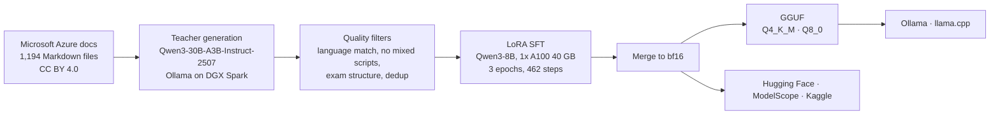

<div align="center">

# QAZTECH® Tutor 8B

**Open multilingual engineering tutor for Microsoft Azure: EN · RU · KK · AR · ES**

[](LICENSE)
[](https://huggingface.co/qaztech-platform/QAZTECH-Tutor-8B)
[](https://huggingface.co/qaztech-platform/QAZTECH-Tutor-8B-GGUF)
[](https://ollama.com/qaztech-platform/tutor)
[](https://huggingface.co/Qwen/Qwen3-8B)
[](CHANGELOG.md)
[](https://github.com/qaztech-platform/qaztech-tutor/actions/workflows/ci.yml)

</div>

QAZTECH Tutor 8B explains Azure concepts, corrects misconceptions and writes certification-style practice questions with worked explanations. It answers in the student's language. This repository contains the complete, reproducible pipeline that produced the published model: synthetic data generation, quality filtering, LoRA fine-tuning, merging, GGUF export, evaluation and multi-platform publishing.

## Try it

```bash
ollama run qaztech-platform/tutor
```

```python
from transformers import AutoModelForCausalLM, AutoTokenizer
m = "qaztech-platform/QAZTECH-Tutor-8B"
tok = AutoTokenizer.from_pretrained(m)
model = AutoModelForCausalLM.from_pretrained(m, torch_dtype="auto", device_map="auto")
msgs = [{"role": "system", "content": "You are an expert engineering tutor. Reply in the student's language."},
        {"role": "user", "content": "Дай мне тренировочный вопрос по Azure RBAC"}]
ids = tok.apply_chat_template(msgs, add_generation_prompt=True, enable_thinking=False, return_tensors="pt").to(model.device)
print(tok.decode(model.generate(ids, max_new_tokens=400)[0][ids.shape[1]:], skip_special_tokens=True))
```

Use `enable_thinking=False`: the model is trained without reasoning traces.

## Where to get it

| Platform | Artifact | Link |
|---|---|---|
| Hugging Face | bf16 safetensors (16.4 GB) | [qaztech-platform/QAZTECH-Tutor-8B](https://huggingface.co/qaztech-platform/QAZTECH-Tutor-8B) |
| Hugging Face | GGUF Q4_K_M (5.0 GB), Q8_0 (8.7 GB) | [qaztech-platform/QAZTECH-Tutor-8B-GGUF](https://huggingface.co/qaztech-platform/QAZTECH-Tutor-8B-GGUF) |
| Ollama | Q4_K_M, official Qwen3 template | [qaztech-platform/tutor](https://ollama.com/qaztech-platform/tutor) |
| ModelScope | bf16 safetensors | [qaztechplatform/QAZTECH-Tutor-8B](https://modelscope.cn/models/qaztechplatform/QAZTECH-Tutor-8B) |
| Kaggle | Transformers + GGUF variants | [qaztechplatform/qaztech-tutor-8b](https://www.kaggle.com/models/qaztechplatform/qaztech-tutor-8b) |

## Pipeline



| # | Stage | Script | Runs on |
|---|---|---|---|
| 00 | Fetch Azure documentation | [`pipeline/00_fetch_docs.sh`](pipeline/00_fetch_docs.sh) | DGX Spark |
| 01 | Teacher throughput benchmark | [`pipeline/01_bench_teacher.py`](pipeline/01_bench_teacher.py) | DGX Spark |
| 02 | Generation v1 (all modes; explanation and summary kept) | [`pipeline/02_generate_v1.py`](pipeline/02_generate_v1.py) | DGX Spark |
| 03 | Filtering v1, train/eval split | [`pipeline/03_clean_v1.py`](pipeline/03_clean_v1.py) | DGX Spark |
| 04 | Generation v2 (practice-question and misconception modes) | [`pipeline/04_generate_v2.py`](pipeline/04_generate_v2.py) | DGX Spark |
| 05 | Final filtering and merge of v1 + v2 | [`pipeline/05_clean_v2.py`](pipeline/05_clean_v2.py) | DGX Spark |
| 06 | LoRA fine-tuning | [`pipeline/06_train.py`](pipeline/06_train.py) | Lambda 1x A100 40 GB |
| 07 | Merge adapter into base (bf16) | [`pipeline/07_merge.py`](pipeline/07_merge.py) | DGX Spark (CPU) |
| 08 | GGUF export, quantization, Ollama build | [`pipeline/08_export_gguf.sh`](pipeline/08_export_gguf.sh) | DGX Spark |
| 09 | Language and format checks | [`pipeline/09_eval_languages.py`](pipeline/09_eval_languages.py) | DGX Spark (Ollama) |

Step-by-step instructions: [docs/REPRODUCE.md](docs/REPRODUCE.md).

## Results (v0.2)

| Metric | Value |
|---|---|
| Training examples | 4,907 (+200 held out) |
| Held-out eval loss | 0.895 → **0.795** (plateau from step 300, no overfitting) |
| Held-out token accuracy | 0.773 |
| Answer language matches question (EN/RU/KK/AR/ES spot test) | **5 / 5** |
| Reasoning-trace leakage (`<think>` in output) | **0 / 5** |
| Training compute | 1x A100 40 GB, about 55 min (≈ $2) |

Data composition, filters and the full eval-loss curve: [docs/DATA.md](docs/DATA.md), [docs/RESULTS.md](docs/RESULTS.md).

## Limitations

- **Facts can be wrong.** Incorrect permission names and behaviours were observed in testing. Use the model with retrieval over official documentation and verify against Microsoft Learn.
- **Kazakh and Arabic** output has not yet been reviewed by native speakers; Kazakh phrasing can be awkward.
- **Coverage** is limited to RBAC, virtual networks, Azure Resource Manager and App Service documentation.
- Contains **no real Microsoft exam questions**. Not affiliated with or endorsed by Microsoft.

## Roadmap

- [ ] Native-speaker review of Kazakh and Arabic samples; targeted data fixes
- [ ] Retrieval-augmented deployment (DeepTutor or Open WebUI) with Microsoft Entra ID sign-in
- [ ] Broader Azure coverage (identity, storage, networking, AKS)
- [ ] Automated factuality evaluation against documentation
- [ ] Public release of the synthetic training set

## Repository layout

```
pipeline/   numbered stages 00-09: docs, generation, filtering, training, merge, GGUF, evaluation
requirements/  pinned dependencies per environment
publish/    Hugging Face, ModelScope and Kaggle publishing (incl. Kaggle metadata)
deploy/     Ollama Modelfile
docs/       reproduction guide, data, results, publishing
```

## Licence, attribution and trademark

Code and weights: [Apache-2.0](LICENSE). Base model: Qwen3-8B by Alibaba Cloud (Apache-2.0). Training data derived from [Microsoft Azure documentation](https://github.com/MicrosoftDocs/azure-docs) (CC BY 4.0); see [NOTICE](NOTICE). Microsoft and Azure are trademarks of the Microsoft group of companies.

QAZTECH is a registered trade mark of AISC Technologies LTD in the United Kingdom (UK IPO nos. UK00004263700, UK00004317681, UK00004373195). The Apache-2.0 licence does not grant rights to the QAZTECH name or logo; see [TRADEMARK.md](TRADEMARK.md).

## Citation

See [CITATION.cff](CITATION.cff).
